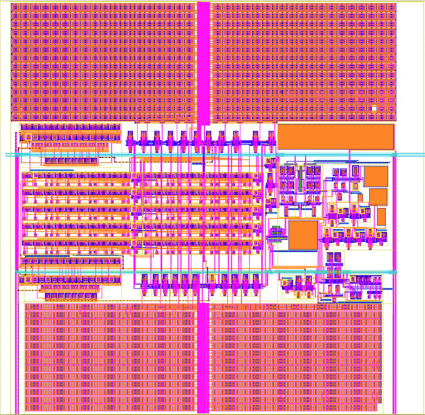

# 22nm FD-SOI Mixed-Signal IC Portfolio

Custom integrated circuit projects focused on analog, mixed-signal, sensing, and high-speed interfaces.

## Featured 22nm FD-SOI Chip

## Featured Project: Multi-Block Mixed-Signal SoC in 22nm FD-SOI
### Included Blocks
- Picoamp current readout for nanopore DNA sensing
- Gas sensor capacitive interface
- High-speed LVDS to CMOS link
- ADC architectures
- Full chip padframe integration

### Responsibilities
- Architecture design
- Schematic design
- Cadence Virtuoso implementation
- Physical layout
- DRC / LVS / Signoff flow
- Tapeout preparation

### Tools
Cadence Virtuoso, Spectre, Calibre, GF 22FDX
