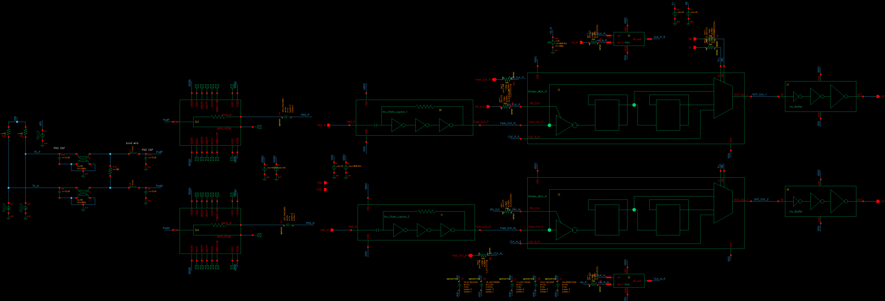
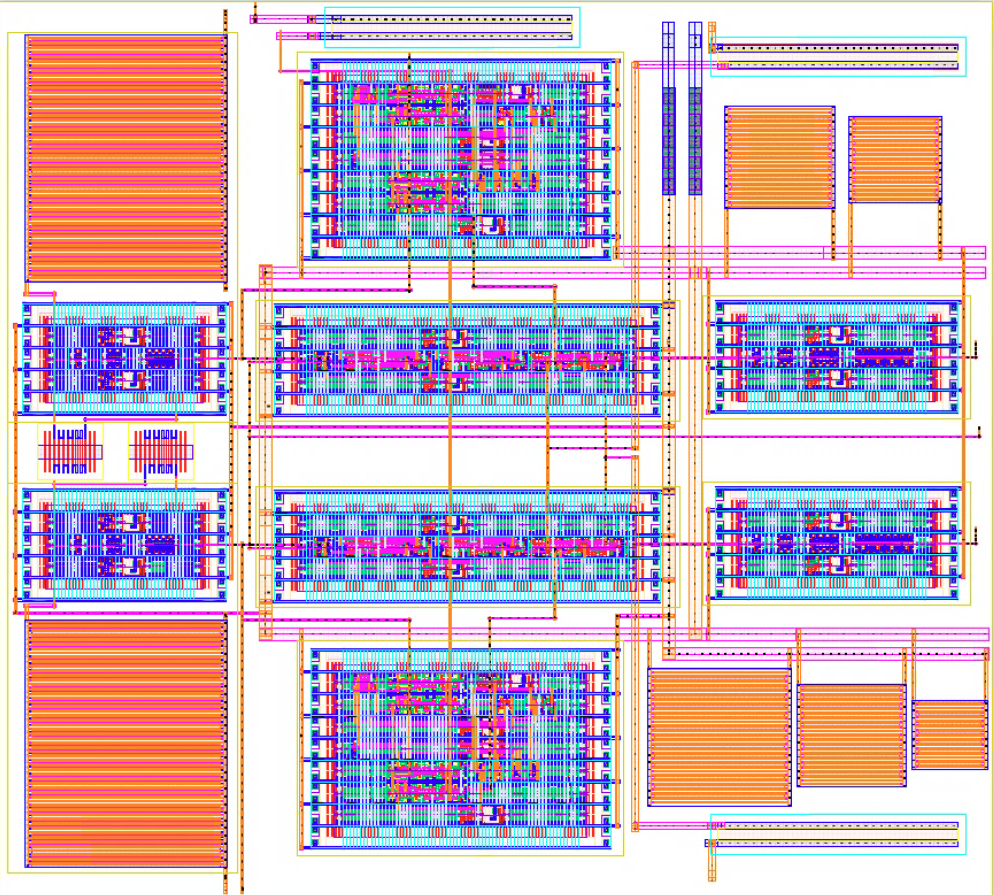
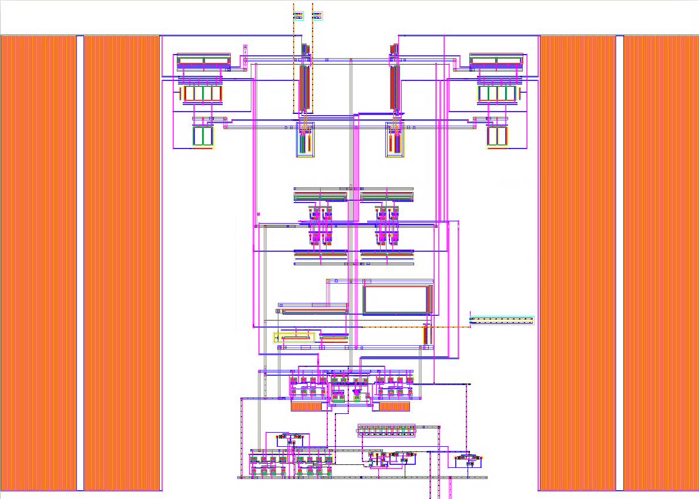
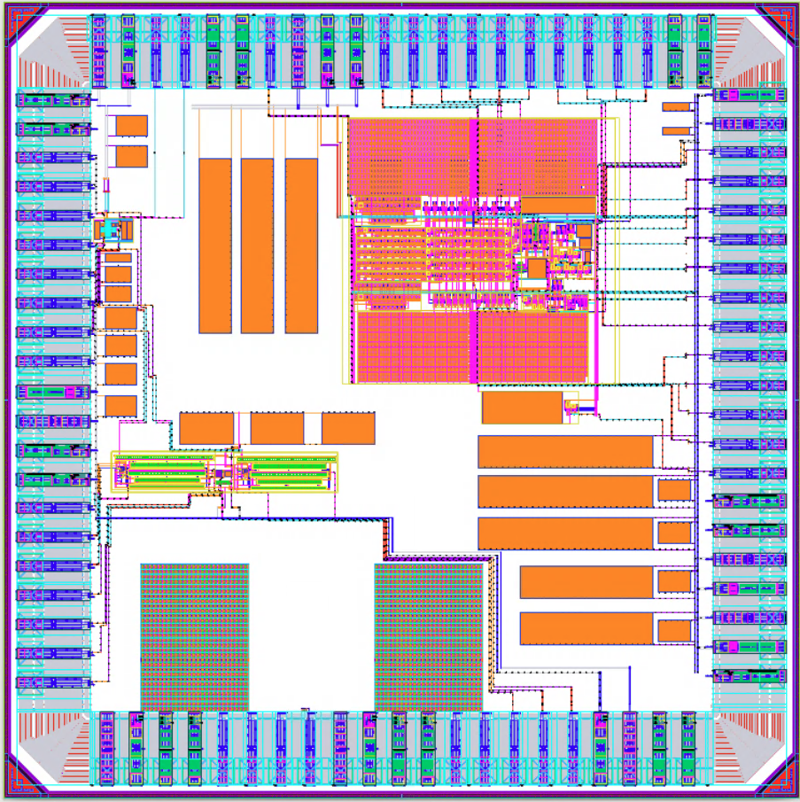

# 22nm FD-SOI Mixed-Signal IC Portfolio

Custom integrated circuit projects focused on analog, mixed-signal, sensing, and high-speed interfaces.

## Featured 22nm FD-SOI Chip

### Gas Sensor Readout IC (PAH Detection)

### High-Speed Link Buffer / LVDS to CMOS Interface

### A Second-Order ΔΣ ADC for DNA Nanopore Readout Interface

This is a second-order delta-sigma analog-to-digital converter in 22-nm. This design serves as the data conversion block in array nanopore readout ICs.

### Full Mixed-Signal Chip Layout

---

## Featured Project: Multi-Block Mixed-Signal SoC in 22nm FD-SOI

### Included Blocks
- Picoamp current readout for nanopore DNA sensing
- Gas sensor capacitive interface
- High-speed LVDS to CMOS link
- ADC architectures
- Full chip padframe integration

### Responsibilities
- Architecture design
- Schematic design
- Cadence Virtuoso implementation
- Physical layout
- DRC / LVS / Signoff flow
- Tapeout preparation

### Tools
Cadence Virtuoso, Spectre, Calibre, GF 22FDX
