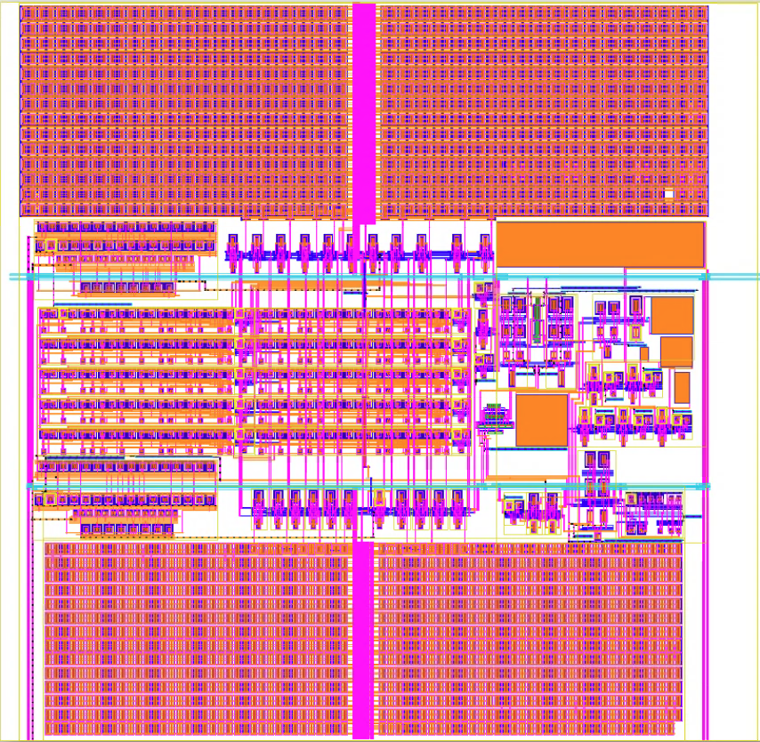
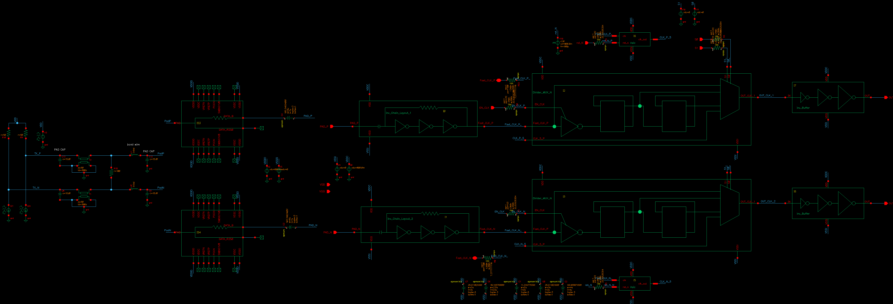
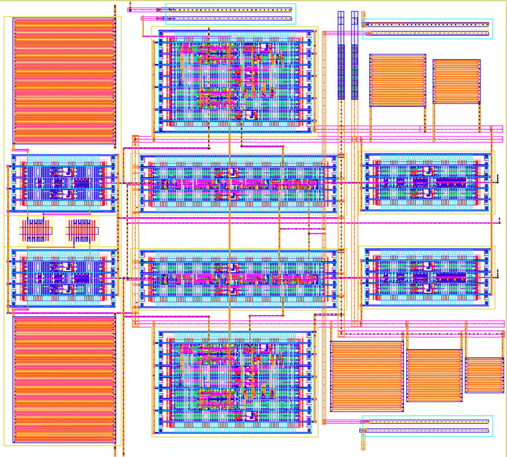
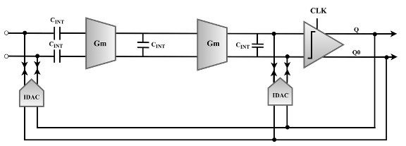
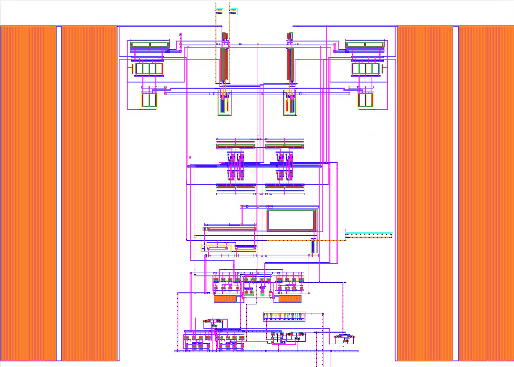
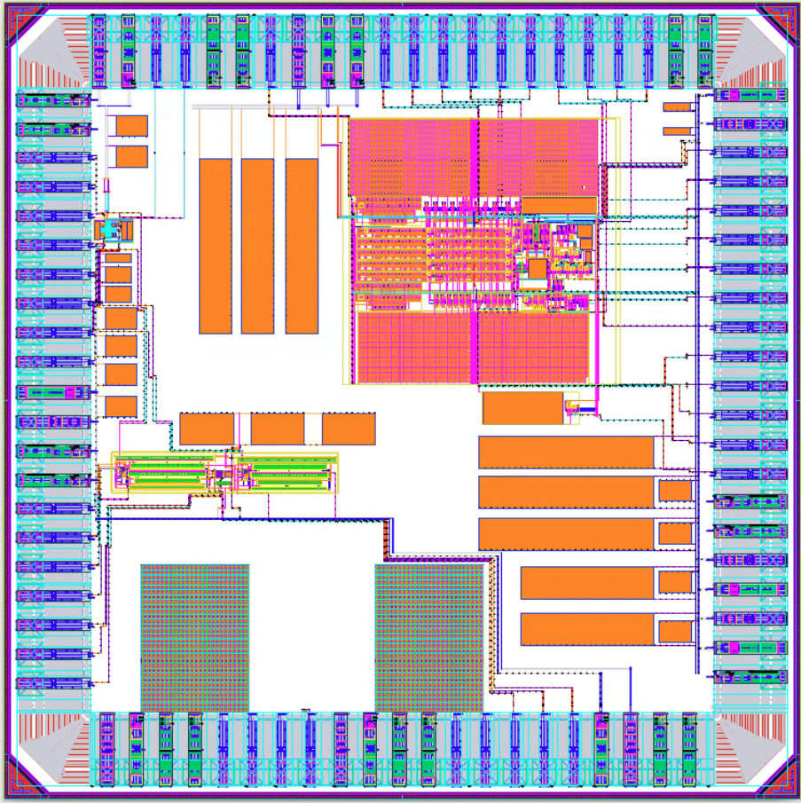

# 22nm FD-SOI Mixed-Signal IC Portfolio

Custom integrated circuit projects focused on analog, mixed-signal, sensing, and high-speed interfaces.

## Featured 22nm, FD-SOI Chip

### Gas Sensor Readout IC (PAH Detection)
For a new project, we designed a current-readout architecture for gas sensing in 22nm FDSOI. The excitation signal is a sine wave superimposed on a staircase signal. The staircase creates a large DC component, which can easily saturate the integrator. So, we implemented a current mirror to subtract the DC currents from the DC staircase and only amplify the AC signal, which contains the information. There is a feedback path for automatic current control that activates IDACs. It injects a compensating current before the integration.

### High-Speed Link Buffer / LVDS to CMOS Interface

### A Second-Order ΔΣ ADC for DNA Nanopore Readout Interface
The idea is that, instead of using the integrator-Filter-CDS-SARADC chain, we directly apply a current input to the sigma-delta and obtain a digitized output.

Here's the schematic:

Layout in 22-nm FDSOI

This is a second-order delta-sigma analog-to-digital converter in 22-nm. This design serves as the data conversion block in array nanopore readout ICs.

### Full Mixed-Signal Chip Layout

---

## Featured Project: Multi-Block Mixed-Signal SoC in 22nm FD-SOI

### Included Blocks
- Picoamp current readout for nanopore DNA sensing
- Gas sensor capacitive interface
- High-speed LVDS to CMOS link
- ADC architectures
- Full chip padframe integration

### Responsibilities
- Architecture design
- Schematic design
- Cadence Virtuoso implementation
- Physical layout
- DRC / LVS / Signoff flow
- Tapeout preparation

### Tools
Cadence Virtuoso, Spectre, Calibre, GF 22FDX
